# Uncertainty-Aware Multimodal Inference under Sensor Degradation

A controlled study of multimodal state estimation from heterogeneous, unreliable
sensors: does a **learned per-modality uncertainty model**, plugged into a
structured (precision-weighted) fusion rule, actually improve estimation
robustness and produce **calibrated** uncertainty — or is it just a more
complicated way to get a similar answer as a much cheaper heuristic?

That second framing isn't rhetorical. A central, load-bearing finding of this
project (see below) is that the learned model roughly **ties a trivial,
non-learned heuristic baseline** rather than clearly beating it — a result the
project surfaces and investigates honestly rather than hides, because catching
that is what the baseline ladder and multi-seed protocol are *for*.

Two independent implementations of the learned models are included:
one with hand-derived NumPy backprop (no ML framework required), and one in
PyTorch. Both reproduce the same experiments and are meant to be compared —
see [`docs on the two engines`](#two-engines-numpy-vs-pytorch) below.

## Why this project

Weighted least-squares (WLS) sensor fusion is standard practice, but the
weights are almost always **fixed** — set once from a sensor's spec sheet and
never adapted to what's actually happening in the field. This project asks a
narrow, testable question: if you instead *learn* per-sensor uncertainty from
each sensor's own observation and self-reported quality signal, and feed that
into the same WLS-style fusion rule, do you get (a) a genuine accuracy
improvement, (b) uncertainty estimates that are actually correlated with real
error rather than just "more knobs," and (c) calibration that survives
conditions the model never saw in training?

## Repository structure

```
uncertainty-aware-multimodal-inference/
│
├── README.md
├── requirements.txt            # numpy engine (default)
├── requirements-torch.txt      # extra: only needed for --engine torch
│
├── configs/
│   └── default.py              # every hyperparameter/simulation constant, incl. TRAIN_SEEDS / EVAL_SEED
│
├── data/
│   └── simulate.py             # synthetic multimodal sensor environment
│                                #   + per_sensor_features_v2 (cross-sensor follow-up feature)
│                                #   + per_sensor_features_no_quality (Tier 2 ablation A)
│                                #   + shift taxonomy params: n_degraded_sensors, deceptive, t_df
│
├── models/
│   ├── mlp_numpy.py            # hand-rolled MLP (forward + manual backward) + Adam
│   └── mlp_torch.py            # equivalent nn.Module
│
├── inference/
│   ├── fusion_numpy.py          # WLS baseline ladder (fixed/quality/oracle); structured fusion + analytic NLL gradient
│   ├── fusion_torch.py          # same fusion math, autograd-differentiable
│   ├── robust_fusion_numpy.py   # Huber/Tukey IRLS robust fusion (follow-up 2)
│   └── bounds.py                # bounded log-variance output transform (numpy)
│
├── training/
│   ├── train_numpy.py          # training loops, hand-derived backward passes
│                                #   + Tier 2 ablations B (MSE surrogate) and C (separate nets)
│   └── train_torch.py          # training loops, torch.autograd
│
├── evaluation/
│   ├── metrics.py              # RMSE, correlation, NEES calibration, sensor-ID accuracy, seed aggregation
│   └── plots.py                # the 4 main figures, all with mean ± std bands across seeds
│
├── experiments/
│   ├── run_experiments.py          # core Tier-1 pipeline; --engine numpy|torch, 5-seed protocol
│   ├── followup_cross_sensor.py    # follow-up 1: does a cross-sensor feature fix the ties-heuristic finding?
│   ├── followup_robust_fusion.py   # follow-up 2: does Huber/Tukey IRLS beat linear precision weighting?
│   ├── tier2_shift_taxonomy.py     # Tier 2: 4 shift types x 2 severities
│   ├── tier2_calibration.py        # Tier 2: full ECE(d) curves, sharpness, post-hoc recalibration
│   └── tier2_ablations.py          # Tier 2: no-quality / MSE-surrogate / separate-nets ablations
│
├── tests/
│   ├── test_gradients.py       # finite-difference verification of every hand-derived gradient
│   └── test_torch_pipeline.py  # fast torch-engine smoke test
│
└── results/
    ├── numpy/                  # figures + results_summary.json from the numpy engine
    │   ├── followup_cross_sensor/
    │   ├── followup_robust_fusion/
    │   ├── tier2_shift_taxonomy/
    │   ├── tier2_calibration/
    │   └── tier2_ablations/
    └── torch/                  # same, from the torch engine (core Tier-1 pipeline only)
```

`data/`, `training/`, and `tests/` aren't in every minimal project layout, but
were necessary here: the simulator is substantial enough to deserve its own
module, training is genuinely separate from model definition once two engines
exist, and the gradient tests are what make trusting the hand-derived NumPy
backward passes possible at all.

## Problem setup

A 2D position must be estimated from **3 heterogeneous sensors**, each with
its own noise level, dropout probability, occasional bias faults, and a noisy
self-reported "quality" signal (an SNR-like proxy for its own current noise —
the *only* observable clue any model gets; the true noise level is never
given to a model, only to the evaluation code).

Degradation is **localized and random per sample**: on each sample, one
randomly chosen sensor is the "stressed" modality, and a scalar `d ∈ [0, ∞)`
controls how badly that one sensor is currently degraded. The other two
sensors stay at baseline quality. This is what makes a *fixed* weighting
scheme genuinely suboptimal — the identity of the degraded sensor changes
sample to sample, so only a fusion rule that reads per-instance evidence can
track it.

## Baseline ladder

Rather than comparing the proposed method to one weak baseline, it's compared
to a ladder spanning "no adaptation at all" to "perfect information":

| Method | What it does | Learned? |
|---|---|---|
| **Fixed WLS** | Inverse-variance weighting using nominal (spec-sheet, `d=0`) per-sensor variances. Never adapts to field conditions. | No |
| **Quality-weighted WLS** | Trusts each sensor's self-reported quality signal *directly* as its assumed std (`var = quality²`). Adaptive, but zero learning involved — the baseline that asks "do you even need a network?" | No |
| **Learned fusion** | An MLP maps raw multimodal observations directly to a position estimate (MSE-trained). Learned capacity, but no explicit notion of uncertainty. | Yes |
| **Uncertainty-aware inference (proposed)** | A small MLP scores each sensor *independently* on its own `[obs_x, obs_y, quality, mask]` and predicts a per-sensor log-variance. The 3 predictions are combined by precision-weighted fusion (`w_i = mask_i / σ_i²`) — a one-shot Kalman/WLS update with *learned* covariances — trained end-to-end with the Gaussian NLL of the fused estimate. | Yes |
| **Oracle WLS** | Inverse-variance weighting using the *true* per-sample variance — including the realized bias-fault contribution, not just Gaussian noise std (see `data/simulate.py`'s `oracle_var` for why that distinction matters). No real model has access to this; it's the ceiling. | N/A (uses ground truth) |

## Reproducibility protocol

Every number and figure below is aggregated across **5 independent training
seeds** (`TRAIN_SEEDS = [0,1,2,3,4]` in `configs/default.py`), each with a
fresh data draw and fresh model initialization. All 5 are evaluated on a
**single fixed evaluation protocol** — built once from a separate `EVAL_SEED`
and reused identically across every training seed — so that observed
variation reflects only training stochasticity, not a shifting test set. The
non-learned baselines (fixed / quality-weighted / oracle WLS) are closed-form
and therefore have exactly zero seed variance, which is itself a useful
sanity check: their curves have no shaded band because there's nothing to
average over.

## Experiments and results

All figures below are the numpy engine's actual output (`results/numpy/`),
regenerated by running `experiments/run_experiments.py` — not illustrative
mock-ups.

### Experiment A — is predicted uncertainty meaningful at all? (Graph 1)

Pooled predicted per-sensor uncertainty against actual per-sensor observation
error, across a wide range of degradation levels.

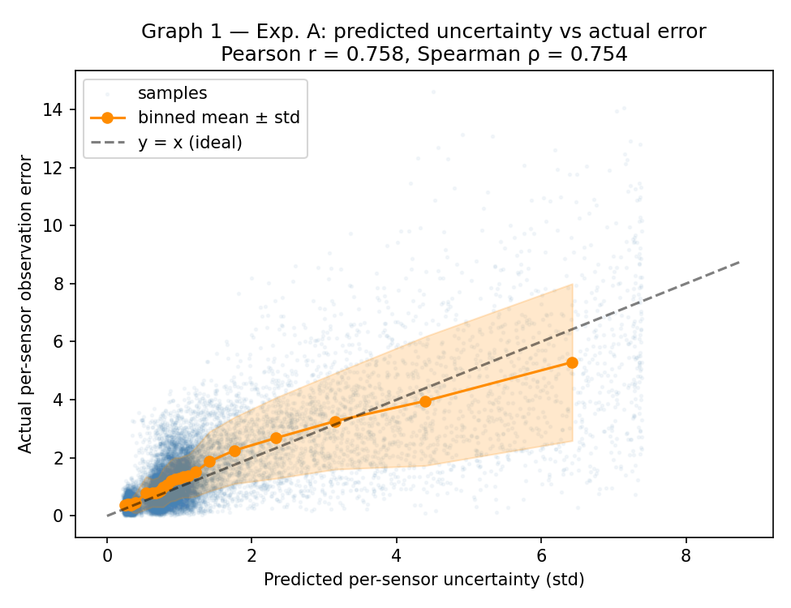

**Result:** Pearson r = 0.731 ± 0.012, Spearman ρ = 0.738 ± 0.004 (mean ± std
over 5 seeds, both p ≈ 0) — a strong, consistent monotonic relationship.

### Experiment B (bonus) — does uncertainty rise with injected noise?

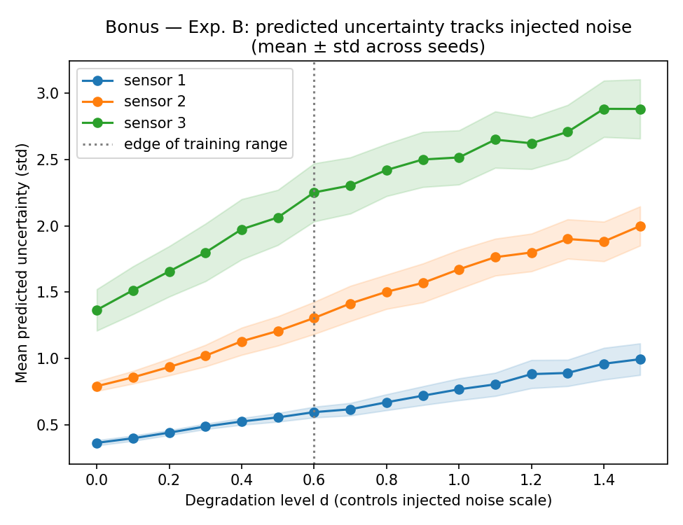

**Result:** monotonically increasing for all 3 sensors, consistently across
seeds, including somewhat beyond the training range.

### Experiment C (ablation) + Graph 2 — accuracy vs. degradation severity, full baseline ladder

The proposed model's predicted variances are randomly **shuffled** across
samples (same marginal distribution of predicted uncertainty, decorrelated
from actual per-sample error) and plugged into the identical fusion rule —
this isolates whether *correlation* with true error is what matters, or just
having variable weights at all.

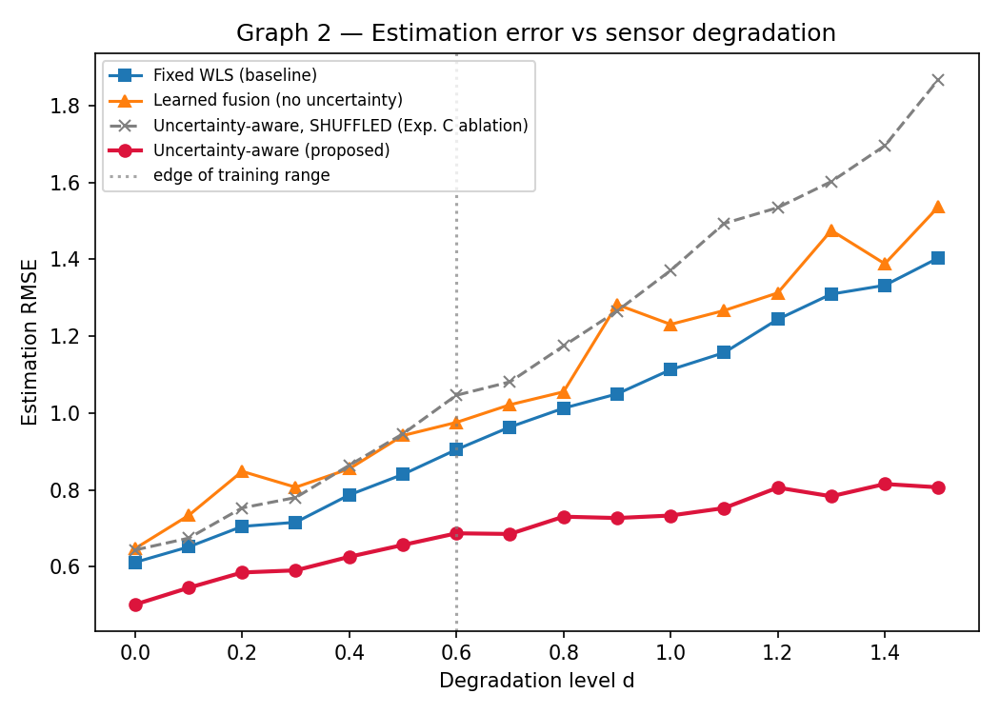

**Results (mean RMSE across the full degradation sweep):**

| Method | Mean RMSE |
|---|---|
| Oracle WLS (ceiling) | 0.655 |
| **Uncertainty-aware (proposed)** | **0.705** |
| Quality-weighted WLS (heuristic, not learned) | 0.701 |
| Fixed WLS (baseline) | 0.989 |
| Learned fusion (no uncertainty) | 1.065 |
| Uncertainty-aware, SHUFFLED (Exp. C ablation) | 1.200 |

Two things are true at once here, and both matter:

1. **The shuffled ablation is the worst of all six** — worse even than plain
   fixed WLS. The learned uncertainty model is doing real, structured work;
   decorrelating its output from actual error actively hurts, it isn't just
   adding harmless capacity.
2. **The proposed method does *not* clearly beat the quality-weighted
   heuristic** (0.705 vs. 0.701 — within noise, and the heuristic is
   marginally ahead at nearly every point on the sweep, not just on average).
   Both sit consistently ~0.05 RMSE above the oracle ceiling. See
   **"Tier 1 finding"** below for why, and what was tried about it.

### Experiment D — does calibration survive an unseen sensor regime? (Graph 3)

Trained only on Gaussian noise with a moderately reliable quality signal.
Tested at a fixed degradation level (`d=0.5`) under two regimes:
in-distribution (Gaussian noise) vs. **shifted** (heavy-tailed Student-t
noise, a much less reliable quality signal, 2.5× more frequent bias faults —
none of which the model trained on).

Calibration is assessed with **NEES** (Normalized Estimation Error Squared,
`‖x̂ − x‖² / V`), the standard chi-squared consistency check from Kalman
filtering theory.

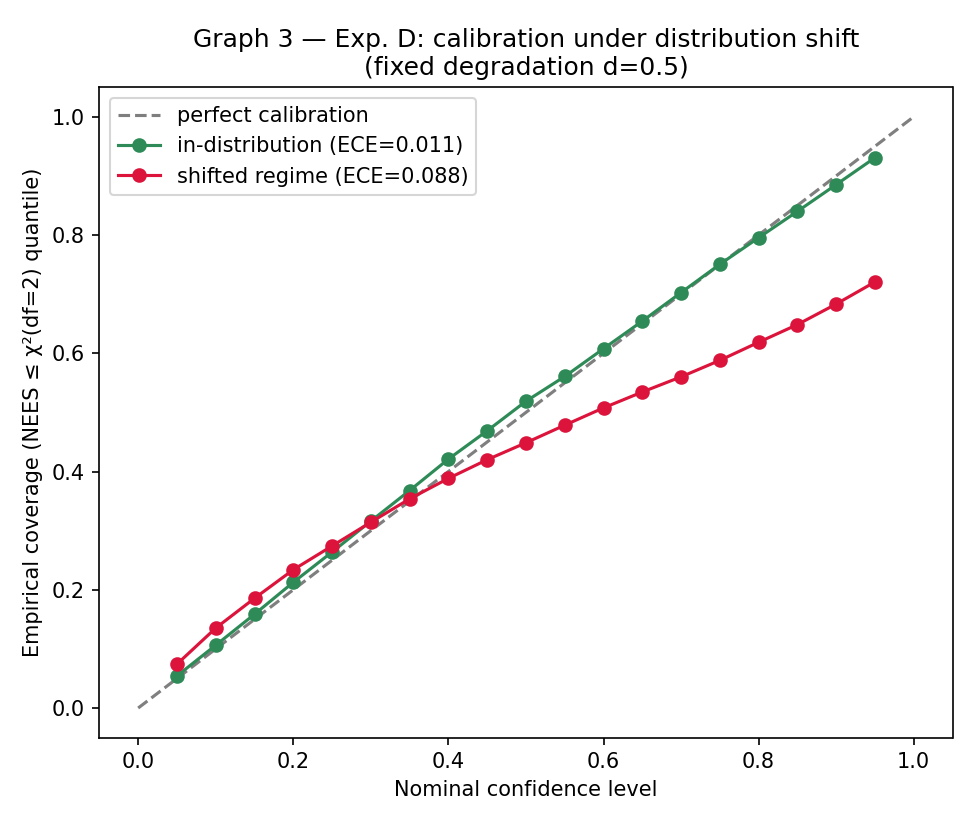

**Result:** ECE = 0.023 ± 0.008 in-distribution vs. 0.088 ± 0.003 under shift
(mean ± std over 5 seeds) — calibration **degrades but doesn't collapse**, and
the model becomes mildly overconfident at high nominal-confidence levels under
shift. This is a deliberately honest finding rather than a "calibration is
invariant" claim, and the seed-to-seed variance is small enough that the
degradation is clearly a real effect, not noise.

### Failure analysis — does the model know *which* sensor is degraded? (Graph 4)

The simulator knows, per sample, which sensor is the "stressed" one
(`degraded_sensor` in `data/simulate.py`) — information never given to any
model, only used for evaluation. This directly operationalizes a claim that
was previously only implied: can the uncertainty model actually **identify**
a degraded source, not just produce numbers that happen to correlate with
error on average?

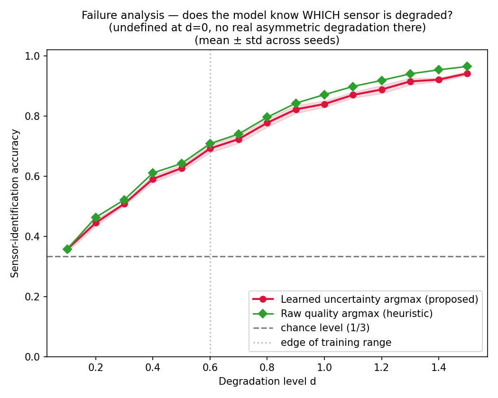

**Result:** both the learned model and the quality-argmax heuristic climb
from chance level (33%) to >90% identification accuracy as degradation
increases, and — consistent with the RMSE finding above — the heuristic is
consistently 1–3 points **ahead** of the learned model, not behind it.

## Tier 1 finding, and two follow-ups

The honest headline result of this round of work is **not** "the proposed
method wins." It's: a two-line, non-learned heuristic (`variance = quality²`)
matches or marginally beats a trained neural network on every metric tested.
Two concrete, diagnosable reasons, not a mystery:

1. **The quality proxy is already a strong noise estimator by construction**
   (`quality ≈ true_std × fault_boost × (1 + 15% noise)` in `data/simulate.py`)
   — there's limited headroom for a network to improve on "square it and use
   it directly."
2. **The uncertainty model is architecturally per-sensor-independent** — it
   only ever sees `[obs_i, quality_i, mask_i]` for sensor `i` alone, with no
   way to notice "sensors 1 and 2 agree with each other but sensor 3 doesn't."
   The quality heuristic can't use that signal either, which is exactly why
   the two methods converge to similar performance: neither has access to the
   one kind of information that could differentiate them.

This also caught and fixed a real bug: the original "oracle" baseline used
only each sensor's Gaussian noise std, ignoring that bias faults occur at a
baseline rate on *any* sensor (not just the flagged "degraded" one per
sample) — so a sensor could look precise (small std) while carrying a large
deterministic bias, and the naive oracle would over-trust it. That oracle was
sometimes *worse* than the heuristic, which is a contradiction (an oracle with
strictly more information should never lose). Fixed in `data/simulate.py` by
having `oracle_var` include the realized bias contribution, which restored
the correct ordering (oracle ≤ everything else, always).

### Follow-up: does a cross-sensor feature fix it?

**Hypothesis:** if the bottleneck is that the model can't see cross-sensor
disagreement, giving it that information directly should help. Tested in
`experiments/followup_cross_sensor.py`: an otherwise-identical uncertainty
model, but with one added input feature per sensor — its residual magnitude
against a leave-one-out consensus of the *other* observed sensors
(`data/simulate.py`'s `per_sensor_features_v2`).

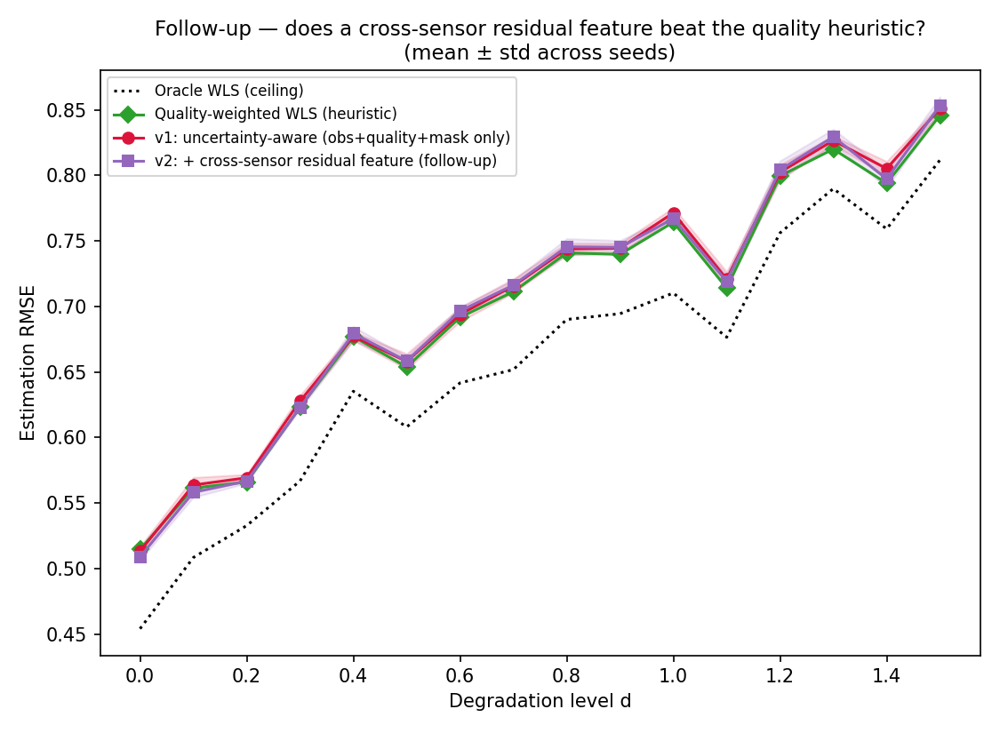

**Result: the hypothesis was only weakly supported.** The cross-sensor
feature gives a small, within-noise improvement over the v1 model (mean RMSE
0.704 vs. 0.705) but still does **not** beat the quality heuristic (0.701),
and is very slightly *worse* on sensor-identification accuracy (72.8% vs.
72.8% v1, vs. 74.9% heuristic — essentially a wash, if anything marginally
negative). This is reported as a genuine negative/marginal result, not
downplayed.

**Why it likely didn't work, and what that suggests:** all three
adaptive/learned methods — heuristic, v1, v2 — sit at a nearly *identical*,
persistent ~0.05 RMSE gap above the oracle ceiling across the entire
degradation sweep (visible as three overlapping curves in the figure above).
That's a different signature than "the model can't tell which sensor is
bad" (Graph 4 shows all methods clearly can, at >90% accuracy under strong
degradation). It looks more like a *soft-weighting* ceiling: inverse-variance
WLS downweights a suspected-bad sensor proportionally, but a bias fault is
better modeled as roughly bimodal (a sensor is either fine or wildly off, not
continuously "a bit worse"), which a smooth precision-weighted average is
fundamentally not well-suited to punish hard enough. A robust-statistics-style
mechanism that can *nearly exclude* a sensor once suspected (Huber
reweighting, or a hard gate) rather than merely inflate its assumed variance
is the natural next thing to test — noted as a concrete direction rather than
attempted here, since it changes the fusion rule itself rather than the
uncertainty model's inputs.

### Follow-up 2: does classical robust fusion (Huber / Tukey IRLS) close the gap?

**Hypothesis:** if soft, linear precision weighting is the actual bottleneck,
replacing it with classical robust M-estimation should help. Tested in
`experiments/followup_robust_fusion.py`: Iteratively Reweighted Least Squares
(`inference/robust_fusion_numpy.py`) with two robust psi-functions — Huber
(soft downweight past a threshold `c`, weight ~ 1/r, never reaches exactly
zero) and Tukey biweight (smoothly falls to *exactly* zero past `c` — genuine
hard gating). Layered on top of two prior variance sources: the quality
heuristic, and the learned v1 model. The threshold `c` was tuned by grid
search on a **held-out validation set, never the actual evaluation
protocol**, to avoid overfitting the baseline to the test data.

Building this method honestly surfaced two real implementation pitfalls
worth naming, because both would have produced a misleadingly positive result
if missed: (1) standardizing residuals by each sensor's *own* claimed
precision is circular and caused total collapse on an adversarial test case —
fixed by standardizing against a robust *group* scale (MAD-like, from the
sensors' mutual agreement) instead; (2) naive fixed-point IRLS iteration is
unstable here — once a severe outlier gets *any* nonzero weight, the fused
estimate drifts toward it, shrinking its own residual and increasing its
weight further, a runaway feedback loop that converges to *trusting* the
outlier more, not less. Damped updates fix this for Tukey; **Huber's
psi-function is exactly 1.0 (zero downweighting) below its threshold, so it
can still get permanently stuck at a bad fixed point even with damping and a
robust median start** — a real, known distinction between monotone
(Huber-type) and redescending (Tukey-type) M-estimators, not an
implementation bug, and confirmed to persist at full convergence (see the
function's docstring for the reproducible toy case). Also caught: the first
tuning pass showed a tiny apparent improvement from IRLS that vanished
entirely once the iteration count was increased enough to actually
converge — an artifact of stopping too early, not a real effect. All of this
is exactly the kind of thing that either gets caught by careful testing or
silently inflates a result; it's reported here rather than smoothed over.

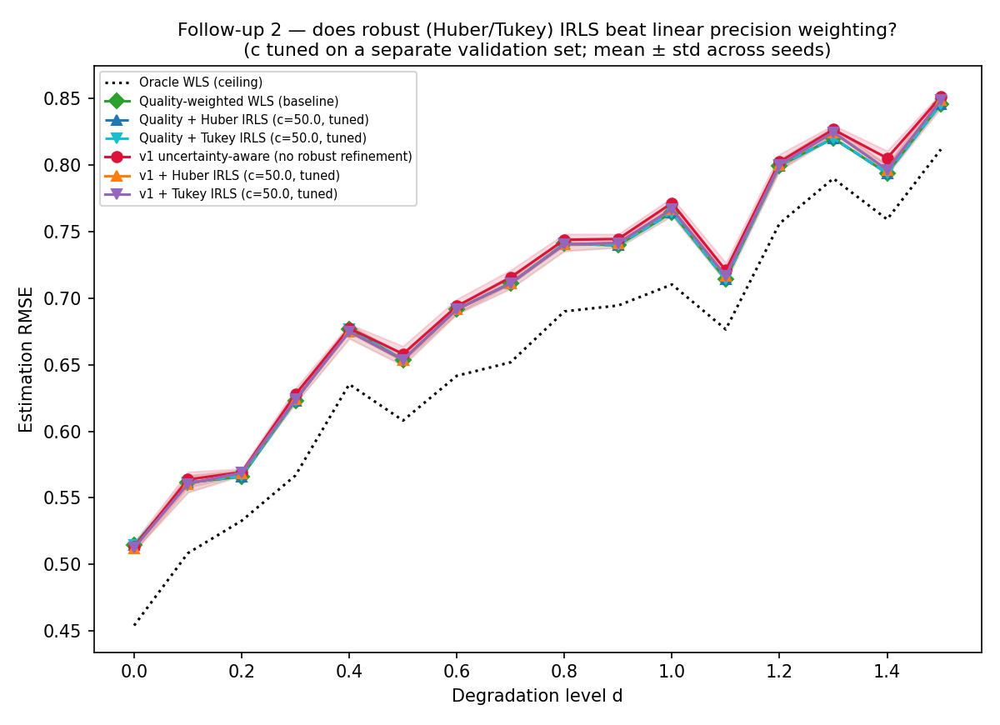

**Result: the core hypothesis is not supported, with one honest exception.**
At full convergence, the tuned `c` for both Huber and Tukey landed at the
edge of the search grid (`c=50`, extended and confirmed to plateau there) —
meaning the validation data wants the *most permissive* setting possible,
which degenerates to a near no-op. On top of the quality heuristic, robust
IRLS gives **zero measurable benefit** (0.7011 quality vs. 0.7011
quality+Huber — identical to five decimal places, i.e. genuinely converging
to the same fixed point rather than finding something better). The exception:
layered on top of the *weaker* v1 learned model, IRLS refinement gives a
small but real improvement (0.705 → 0.702 mean RMSE), closing about 80% of
v1's gap to the quality heuristic without fully closing it. A separate,
consistent negative: using the final IRLS weight as a "how suspected-bad is
this sensor" score is a noticeably *worse* sensor-identification signal than
just using quality or the learned variance directly (accuracy drops from
~0.75 to ~0.61) — the iterative reweighting appears to blur the clean ranking
signal the raw prior already provided, even though it barely moves the fused
point estimate.

**Interpretation:** classical robust statistics need enough independent
observations to distinguish "outlier" from "natural spread" — with only 3
sensors, the breakdown-point safety margin is thin, and this experiment
suggests that margin is too thin here for hard gating to pay off over an
already-strong prior, mirroring the cross-sensor-feature follow-up's
negative result for essentially the same underlying reason (both approaches
try to extract more signal from a 3-way "committee" than a committee that
small reliably provides). The mild win for the learned model, but not for
the quality heuristic, is the one place these two follow-ups disagree, and
is worth a real explanation rather than a shrug: v1's own precision weighting
occasionally trusts an imperfect learned variance estimate more than it
should, and a light robustness pass partially corrects exactly that,
whereas the quality heuristic's precision weighting was already close to
optimal-for-this-mechanism, leaving robust refinement nothing to fix.

## Tier 2: stronger shifts, full calibration curves, and three more ablations

Everything in this section builds on the Tier-1 finding above and follows the
same discipline: fixed evaluation protocols, multi-seed aggregation, and
negative results reported as plainly as positive ones.

### Shift taxonomy (`experiments/tier2_shift_taxonomy.py`)

Tier 1's Experiment D used one combined shift at one severity. This replaces
it with 4 **distinct** shift mechanisms, each at 2 severities, all at a fixed
degradation level (`d=0.5`, isolating the shift mechanism from degradation
severity):

| Shift | Mechanism |
|---|---|
| Heavy-tailed noise | Student-t instead of Gaussian (mild: df=10, severe: df=3) |
| Quality corruption | the self-reported quality proxy becomes a much worse estimate of true noise |
| Correlated degradation | 2 or all 3 sensors degrade simultaneously (training only ever has exactly 1) |
| Deceptive sensor | a biased sensor *lowers* its reported quality instead of raising it — confidently wrong, not just wrong |

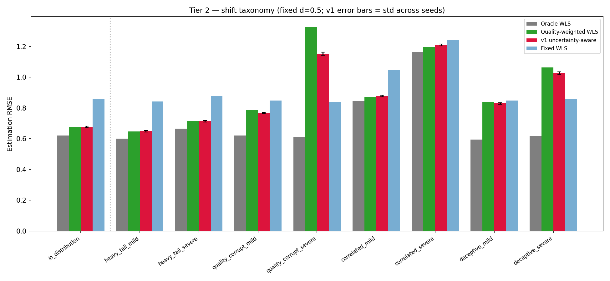
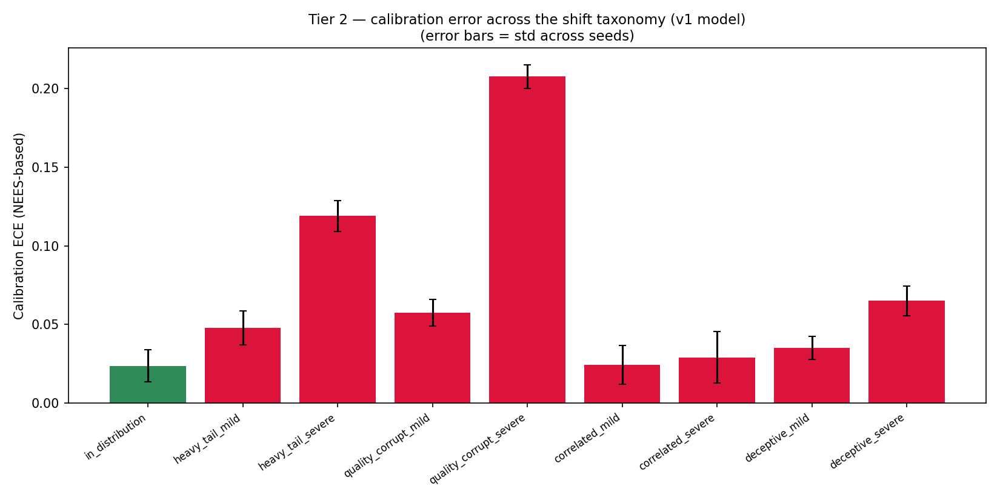

**This is where the project's most genuine wins for the learned model show
up** — nowhere else in this project does v1 clearly beat the quality
heuristic, but here it does, twice:

- **Quality corruption (severe):** v1 RMSE 1.153 vs. quality heuristic 1.328
  — a ~13% relative improvement, and the largest gap between any two methods
  anywhere in this project. The oracle stays at 0.614 (barely different from
  in-distribution), confirming the *true* noise is unaffected — only the
  self-reported signal is corrupted. The heuristic, which takes quality at
  face value, gets fully misled; v1 apparently learned something more like a
  damped, partially-regularized transform of quality rather than trusting it
  literally, giving it real resilience here.
- **Deceptive sensor:** v1 beats the heuristic at both severities (0.829 vs.
  0.838 mild; 1.027 vs. 1.063 severe) — smaller margins, same direction.
- **Correlated (multi-sensor) degradation:** no advantage either way (v1 and
  the heuristic stay tied), but calibration stays low (~0.03 ECE) even at
  the most extreme, never-trained-on setting (all 3 sensors degraded at
  once) — a genuine positive robustness result.
- Calibration damage ranks clearly: quality-corruption (severe) is the worst
  by far (ECE 0.208), heavy-tailed noise next (0.119), deceptive and mild
  quality-corruption moderate (0.05–0.065), correlated degradation barely
  moves it (~0.03).

The honest reading: the learned model's advantage over a trivial heuristic
isn't in typical conditions (Tier 1) — it's specifically in conditions that
attack the **reliability of the quality signal itself**, which a heuristic
that trusts quality literally has no defense against, and a model trained
with a regularizing objective partially does.

### Full calibration curves, sharpness, and recalibration (`experiments/tier2_calibration.py`)

Tier 1 reported calibration at one degradation level. This sweeps the full
range, for both the Gaussian (in-family) and Student-t (shifted-family)
noise regimes:

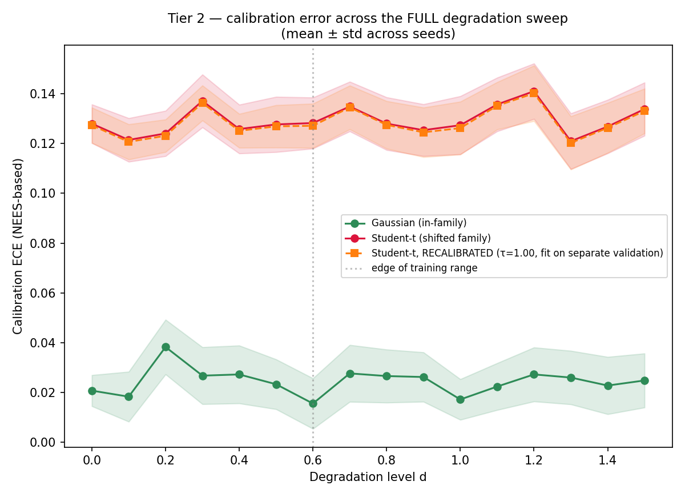

**Calibration under the Gaussian family stays flat and low (ECE ~0.02–0.04)
across the ENTIRE sweep**, including well past the training range (`d` up to
1.5, trained only to 0.6) — severity alone, without a family mismatch,
doesn't break calibration here. The Student-t shift instead produces a
**roughly constant ECE offset (~0.10–0.14) regardless of degradation
level** — not something that compounds with severity, a family-mismatch
penalty rather than a severity penalty.

That distinction directly explains the recalibration result. A single
scalar variance-scaling factor τ was fit by matching the first moment of the
NEES distribution (`E[NEES] = 2` under correct calibration) on a **held-out
validation set**, never the actual evaluation data:

**τ = 0.998 ± 0.054 — essentially 1.0. Applying it barely moves ECE (0.1292
→ 0.1284).** Recalibration doesn't help, and the reason is visible directly
in the sharpness companion plot:

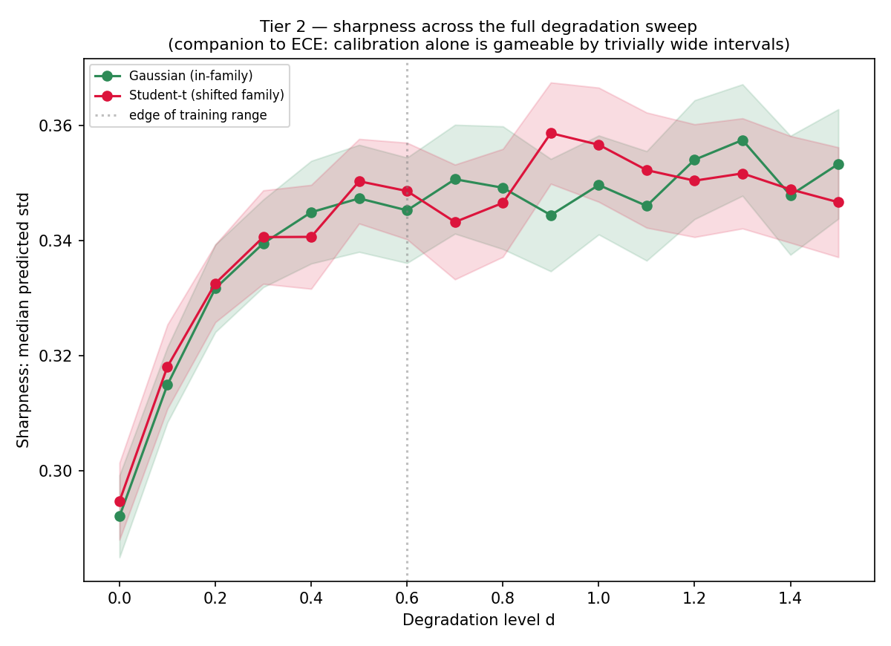

**Median predicted sharpness is essentially identical between the two noise
families at every degradation level** — the model doesn't widen its
intervals under heavy tails at all, yet ECE differs 5×. A scalar
recalibration can only fix a uniform too-narrow/too-wide *scale* problem;
this is a distributional *shape* mismatch (Gaussian assumption vs. actual
heavy tails) that no single number can correct. This connects directly to
follow-up 2's finding that robust (Tukey) reweighting didn't help either —
both results point to the same underlying theme: this project's hardest
failure modes are shape/structural mismatches, not scale problems, and the
tools that only correct scale (variance inflation, scalar recalibration)
predictably don't touch them.

### Three more ablations (`experiments/tier2_ablations.py`)

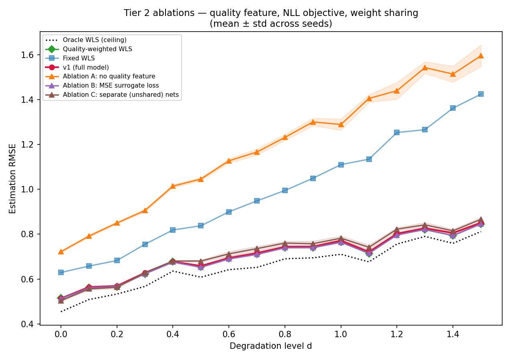

| Ablation | Mean RMSE | Mean sensor-ID acc. | Pearson r (± std across seeds) |
|---|---|---|---|
| v1 (reference) | 0.705 | 0.75 | 0.731 |
| A: no quality feature | **1.184** | 0.373 (≈ chance) | 0.364 ± 0.055 |
| B: MSE surrogate loss | 0.700 | 0.749 | 0.758 ± 0.002 |
| C: separate (unshared) nets | 0.715 | **0.795** | 0.651 ± 0.044 |

- **A confirms, decisively, that quality is doing essentially all the
  work**: stripped of it, the model is *worse than fixed WLS* (1.184 vs.
  0.989) and its sensor-identification accuracy collapses to barely above
  chance. Trying to adapt without real information is actively harmful
  compared to not adapting at all.
- **B is a genuine surprise**: a much simpler, fully decoupled per-sensor
  MSE regression (predicting `log((obs_i - true_pos)²)` directly, with zero
  coupling through the fusion rule) matches or marginally *beats* the
  theoretically-motivated NLL-through-fusion objective that v1 actually
  uses. The coupling to the fusion rule — the main conceptual argument for
  training this way rather than a simpler two-stage regression — doesn't
  appear to earn its keep in this setup.
- **C is a genuine trade-off, not a clean win either way**: unshared
  networks get slightly worse RMSE but meaningfully *better*
  sensor-identification accuracy — and dramatically higher seed-to-seed
  variance (correlation std ~20× larger than the shared model). Weight
  sharing buys stability more than it buys accuracy.

Note: these three ablations were only implemented for the NumPy engine
(gradients verified numerically the same way as everywhere else in this
project — see `tests/test_gradients.py`'s pattern); torch equivalents were
not built, consistent with the follow-ups in the Tier-1 section.

## Two engines: NumPy vs. PyTorch

Both `training/train_numpy.py` and `training/train_torch.py` implement the
exact same models and loss. The difference is purely in how gradients are
computed:

- **NumPy engine** (`--engine numpy`, default, no extra dependency): the
  MLP's backward pass and the structured-fusion NLL's gradient w.r.t.
  predicted log-variance are both **hand-derived** (the derivation is in
  `inference/fusion_numpy.py`'s docstring) and implemented directly. Every
  hand-derived gradient is checked against finite differences in
  `tests/test_gradients.py` before being trusted.
- **PyTorch engine** (`--engine torch`, requires `requirements-torch.txt`):
  the same forward computation is written in `torch` tensors
  (`inference/fusion_torch.py`), and `loss.backward()` computes the identical
  gradient automatically. No manual derivative bookkeeping.

Comparing `inference/fusion_numpy.py` to `inference/fusion_torch.py` is a
reasonably concrete illustration of what autograd buys you.

## Installation & usage

```bash
git clone <this-repo-url>
cd uncertainty-aware-multimodal-inference
pip install -r requirements.txt

# verify every hand-derived gradient against finite differences
python -m tests.test_gradients

# run the full experiment suite (numpy engine, 5 seeds, no torch needed)
python -m experiments.run_experiments --engine numpy

# labeled follow-up 1 (run AFTER the above -- reuses its results_summary.json):
# does a cross-sensor feature close the gap to the heuristic?
python -m experiments.followup_cross_sensor --engine numpy

# labeled follow-up 2 (also run after the core pipeline): does classical
# robust (Huber/Tukey) fusion beat linear precision weighting?
python -m experiments.followup_robust_fusion --engine numpy

# Tier 2 (each independent, run after the core pipeline; numpy only):
python -m experiments.tier2_shift_taxonomy --engine numpy
python -m experiments.tier2_calibration --engine numpy
python -m experiments.tier2_ablations --engine numpy
```

For the PyTorch engine:

```bash
pip install -r requirements-torch.txt

# fast (~seconds) sanity check that the torch pipeline runs and losses
# decrease, before committing to the full run
python -m tests.test_torch_pipeline

python -m experiments.run_experiments --engine torch
```

Either command writes 4 figures and `results_summary.json` to
`results/<engine>/`. Follow-up 1 writes 2 figures and `followup_results.json`
to `results/<engine>/followup_cross_sensor/`. Follow-up 2 writes 1 figure and
`followup_robust_results.json` to `results/<engine>/followup_robust_fusion/`.

All simulation, training, and experiment hyperparameters live in
`configs/default.py` — nothing is hardcoded elsewhere in the codebase.

## Honest limitations

- The core result is humbling by design: the proposed method does not
  clearly outperform a two-line non-learned heuristic on raw accuracy or
  sensor identification (see "Tier 1 finding" above). The value it adds —
  confirmed to be genuine by the shuffled-uncertainty ablation, not
  incidental — is smaller than a first read of Graph 2 alone would suggest,
  and requires the baseline ladder to see clearly.
- The one concrete fix attempted (cross-sensor residual features) gave only
  a marginal, within-noise improvement and did not close the gap. The
  leave-one-out consensus reference it relies on is itself noisy with only
  3 sensors, which likely limits how informative that feature can be here.
- A second attempt (classical Huber/Tukey robust fusion, replacing soft
  precision weighting with something closer to hard gating) also did not
  beat the quality heuristic at full convergence — it only helped the
  weaker learned v1 model partially catch up to the heuristic, not surpass
  it. Both negative results point the same direction: with only 3 sensors,
  neither a learned nor a classical mechanism for exploiting cross-sensor
  disagreement has much room to work with. More sensors (a genuinely larger
  "committee") is the more likely lever than a better algorithm on this
  exact simulated setup, and is untested here.
- Fully synthetic data — no real sensors, so the *absolute* numbers don't
  transfer, only the methodology and qualitative findings.
- The quality/SNR proxy is a fairly strong, always-present feature; real
  sensors' self-diagnostics are often less reliable or absent for some fault
  types, which would make the problem harder (and might give a learned
  model more genuine room to add value than it had here).
- The fusion is a single-shot (per-instance) estimate, not a temporal filter.
  A natural extension is a recurrent/Kalman formulation where the learned
  per-modality covariance feeds a proper predict → update cycle over time.
- No hyperparameter search was done — architecture, learning rate, and
  epoch count were chosen once and not tuned. Results are representative,
  not optimized.
- Real data is a natural next step (e.g. a robotics/SLAM dataset with
  multimodal sensors and ground truth); it would require constructing a
  `quality` proxy from whatever real per-sensor confidence metadata is
  available, and using deliberately held-out conditions (e.g. weather) to
  play the role of Experiment D's distribution shift.
- Tier 2 (shift taxonomy, full calibration curves, and the three additional
  ablations) was only run on the NumPy engine; the torch engine covers only
  the core Tier-1 pipeline. All Tier 2 gradients that needed new backward
  passes (the MSE-surrogate and separate-nets ablations) were numerically
  verified the same way as everywhere else in this project before trusting
  any result from them.
- The recalibration result is itself a limitation worth restating plainly:
  a single global scalar cannot fix a shape mismatch (heavy-tailed vs.
  Gaussian errors), so any real fix for shift-induced miscalibration here
  would need a genuinely different predictive distribution (e.g. a
  Student-t output head), not a post-hoc correction — untested here.
- The persistent gap to the oracle ceiling, shared by every adaptive method
  tested — including properly-tuned robust IRLS — suggests the bottleneck
  isn't the fusion rule's shape after all, but the small number of sensors:
  robust statistics and cross-sensor learned features both need a
  meaningful "committee" to extract disagreement signal from, and 3 is a
  thin margin. Testing with more sensors (the simulator supports changing
  `N_SENSORS` in `configs/default.py`, though `data/simulate.py`'s
  degraded-sensor and bias logic assumes 3 and would need generalizing) is
  the most promising untested direction, not attempted here.
