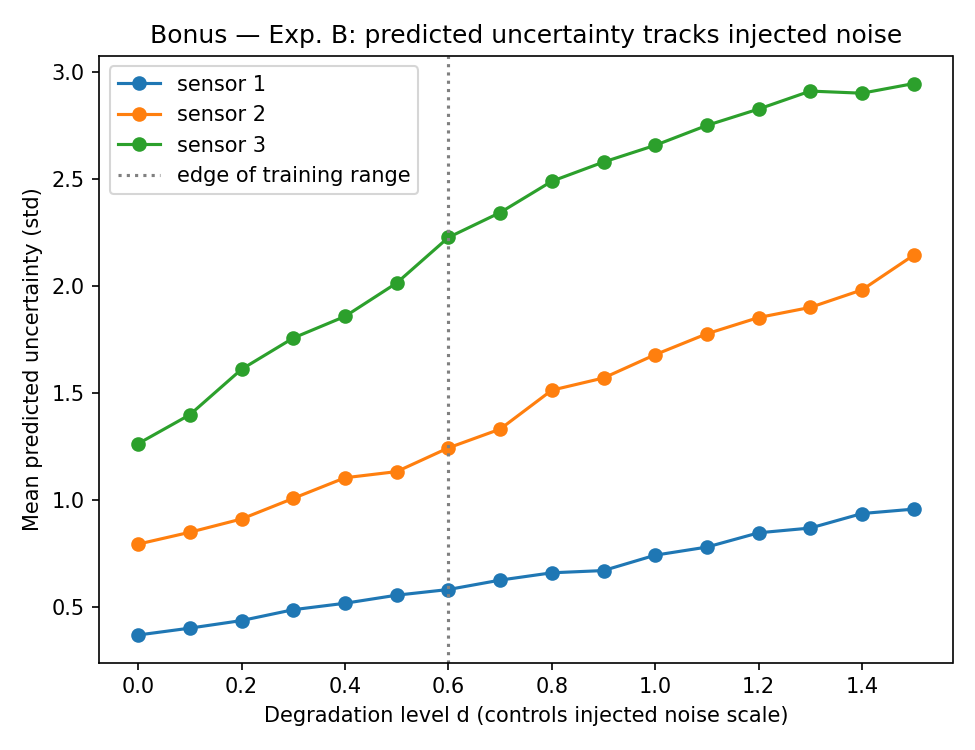

# Uncertainty-Aware Multimodal Inference under Sensor Degradation

A controlled study of multimodal state estimation from heterogeneous, unreliable
sensors: does a **learned per-modality uncertainty model**, plugged into a
structured (precision-weighted) fusion rule, actually improve estimation
robustness and produce **calibrated** uncertainty — or is it just a more
complicated way to get a similar answer?

Two independent implementations of the learned models are included:
one with hand-derived NumPy backprop (no ML framework required), and one in
PyTorch. Both reproduce the same experiments and are meant to be compared —
see [`docs on the two engines`](#two-engines-numpy-vs-pytorch) below.

## Why this project

Weighted least-squares (WLS) sensor fusion is standard practice, but the
weights are almost always **fixed** — set once from a sensor's spec sheet and
never adapted to what's actually happening in the field. This project asks a
narrow, testable question: if you instead *learn* per-sensor uncertainty from
each sensor's own observation and self-reported quality signal, and feed that
into the same WLS-style fusion rule, do you get (a) a genuine accuracy
improvement, (b) uncertainty estimates that are actually correlated with real
error rather than just "more knobs," and (c) calibration that survives
conditions the model never saw in training?

## Repository structure

```
uncertainty-aware-multimodal-inference/
│
├── README.md
├── requirements.txt            # numpy engine (default)
├── requirements-torch.txt      # extra: only needed for --engine torch
│
├── configs/
│   └── default.py              # every hyperparameter/simulation constant, centralized
│
├── data/
│   └── simulate.py             # synthetic multimodal sensor environment
│
├── models/
│   ├── mlp_numpy.py            # hand-rolled MLP (forward + manual backward) + Adam
│   └── mlp_torch.py            # equivalent nn.Module
│
├── inference/
│   ├── fusion_numpy.py         # fixed WLS baseline; structured fusion + analytic NLL gradient
│   ├── fusion_torch.py         # same fusion math, autograd-differentiable
│   └── bounds.py               # bounded log-variance output transform (numpy)
│
├── training/
│   ├── train_numpy.py          # training loops, hand-derived backward passes
│   └── train_torch.py          # training loops, torch.autograd
│
├── evaluation/
│   ├── metrics.py              # RMSE, correlation, NEES-based calibration
│   └── plots.py                # the 3 main figures + 1 bonus figure (1b)
│
├── experiments/
│   └── run_experiments.py      # orchestrates everything; --engine numpy|torch
│
├── tests/
│   └── test_gradients.py       # finite-difference verification of every hand-derived gradient
│
└── results/
    ├── numpy/                  # figures + results_summary.json from the numpy engine
    └── torch/                  # same, from the torch engine
```

`data/`, `training/`, and `tests/` aren't in every minimal project layout, but
were necessary here: the simulator is substantial enough to deserve its own
module, training is genuinely separate from model definition once two engines
exist, and the gradient tests are what make trusting the hand-derived NumPy
backward passes possible at all.

## Problem setup

A 2D position must be estimated from **3 heterogeneous sensors**, each with
its own noise level, dropout probability, occasional bias faults, and a noisy
self-reported "quality" signal (an SNR-like proxy for its own current noise —
the *only* observable clue any model gets; the true noise level is never
given to a model, only to the evaluation code).

Degradation is **localized and random per sample**: on each sample, one
randomly chosen sensor is the "stressed" modality, and a scalar `d ∈ [0, ∞)`
controls how badly that one sensor is currently degraded. The other two
sensors stay at baseline quality. This is what makes a *fixed* weighting
scheme genuinely suboptimal — the identity of the degraded sensor changes
sample to sample, so only a fusion rule that reads per-instance evidence can
track it.

## Three methods compared

| Method | What it does |
|---|---|
| **Fixed WLS** | Inverse-variance weighting using nominal (spec-sheet, `d=0`) per-sensor variances. Never adapts to field conditions. The conventional baseline. |
| **Learned fusion** | An MLP maps raw multimodal observations directly to a position estimate (MSE-trained). Learned capacity, but no explicit notion of uncertainty. |
| **Uncertainty-aware inference (proposed)** | A small MLP scores each sensor *independently* on its own `[obs_x, obs_y, quality, mask]` and predicts a per-sensor log-variance. The 3 predictions are combined by precision-weighted fusion (`w_i = mask_i / σ_i²`) — a one-shot Kalman/WLS update with *learned* covariances — trained end-to-end with the Gaussian NLL of the fused estimate. |

## Experiments and results

All figures below are the numpy engine's actual output (`results/numpy/`),
regenerated by running `experiments/run_experiments.py` — not illustrative
mock-ups.

### Experiment A — is predicted uncertainty meaningful at all? (Graph 1)

Pooled predicted per-sensor uncertainty against actual per-sensor observation
error, across a wide range of degradation levels.


**Result:** Pearson r = 0.758, Spearman ρ = 0.754 (both p ≈ 0) — a strong,
clean monotonic relationship.

### Experiment B — does uncertainty rise with injected noise?



**Result:** monotonically increasing for all 3 sensors, including somewhat
beyond the training range.

### Experiment C (ablation) + Graph 2 — accuracy vs. degradation severity

The proposed model's predicted variances are randomly **shuffled** across
samples (same marginal distribution of predicted uncertainty, decorrelated
from actual per-sample error) and plugged into the identical fusion rule —
this isolates whether *correlation* with true error is what matters, or just
having variable weights at all.


**Result:** the proposed method dominates throughout and the gap **widens**
with degradation (0.50 vs. 0.61 RMSE at `d=0`, 0.81 vs. 1.40 at `d=1.5`).
Critically, the shuffled-uncertainty ablation is the **worst** of all four
methods, including plain fixed WLS — proof that a network which merely
outputs *variable* weights isn't enough; the weights have to be correlated
with actual error to help.

### Experiment D — does calibration survive an unseen sensor regime? (Graph 3)

Trained only on Gaussian noise with a moderately reliable quality signal.
Tested at a fixed degradation level (`d=0.5`) under two regimes:
in-distribution (Gaussian noise) vs. **shifted** (heavy-tailed Student-t
noise, a much less reliable quality signal, 2.5× more frequent bias faults —
none of which the model trained on).

Calibration is assessed with **NEES** (Normalized Estimation Error Squared,
`‖x̂ − x‖² / V`), the standard chi-squared consistency check from Kalman
filtering theory.


**Result:** ECE = 0.011 in-distribution (essentially perfect) vs. 0.088 under
shift — calibration **degrades but doesn't collapse**, and the model becomes
mildly overconfident at high nominal-confidence levels under shift. This is a
deliberately honest finding rather than a "calibration is invariant" claim.

## Two engines: NumPy vs. PyTorch

Both `training/train_numpy.py` and `training/train_torch.py` implement the
exact same models and loss. The difference is purely in how gradients are
computed:

- **NumPy engine** (`--engine numpy`, default, no extra dependency): the
  MLP's backward pass and the structured-fusion NLL's gradient w.r.t.
  predicted log-variance are both **hand-derived** (the derivation is in
  `inference/fusion_numpy.py`'s docstring) and implemented directly. Every
  hand-derived gradient is checked against finite differences in
  `tests/test_gradients.py` before being trusted.
- **PyTorch engine** (`--engine torch`, requires `requirements-torch.txt`):
  the same forward computation is written in `torch` tensors
  (`inference/fusion_torch.py`), and `loss.backward()` computes the identical
  gradient automatically. No manual derivative bookkeeping.

Comparing `inference/fusion_numpy.py` to `inference/fusion_torch.py` is a
reasonably concrete illustration of what autograd buys you.

## Installation & usage

```bash
git clone <this-repo-url>
cd uncertainty-aware-multimodal-inference
pip install -r requirements.txt

# verify every hand-derived gradient against finite differences
python -m tests.test_gradients

# run the full experiment suite (numpy engine, no torch needed)
python -m experiments.run_experiments --engine numpy
```

For the PyTorch engine:

```bash
pip install -r requirements-torch.txt

# fast (~seconds) sanity check that the torch pipeline runs and losses
# decrease, before committing to the full run
python -m tests.test_torch_pipeline

python -m experiments.run_experiments --engine torch
```

Either command writes 4 figures and `results_summary.json` to
`results/<engine>/`.

All simulation, training, and experiment hyperparameters live in
`configs/default.py` — nothing is hardcoded elsewhere in the codebase.

## Limitations

- Fully synthetic data — no real sensors, so the *absolute* numbers don't
  transfer, only the methodology and qualitative findings.
- The quality/SNR proxy is a fairly strong, always-present feature; real
  sensors' self-diagnostics are often less reliable or absent for some fault
  types, which would make the problem harder.
- The fusion is a single-shot (per-instance) estimate, not a temporal filter.
  A natural extension is a recurrent/Kalman formulation where the learned
  per-modality covariance feeds a proper predict → update cycle over time.
- No hyperparameter search was done — architecture, learning rate, and
  epoch count were chosen once and not tuned. Results are representative,
  not optimized.
- Real data is a natural next step (e.g. a robotics/SLAM dataset with
  multimodal sensors and ground truth); it would require constructing a
  `quality` proxy from whatever real per-sensor confidence metadata is
  available, and using deliberately held-out conditions (e.g. weather) to
  play the role of Experiment D's distribution shift.
