# Uncertainty-Aware Multimodal Inference under Sensor Degradation

[](LICENSE)

A controlled study of multimodal state estimation from heterogeneous, unreliable
sensors: does a **learned per-modality uncertainty model**, plugged into a
structured (precision-weighted) fusion rule, actually improve estimation
robustness and produce **calibrated** uncertainty — or is it just a more
complicated way to get a similar answer as a much cheaper heuristic?

That second framing isn't rhetorical. A central, load-bearing finding of this
project (see below) is that the learned model roughly **ties a trivial,
non-learned heuristic baseline** rather than clearly beating it — a result the
project surfaces and investigates honestly rather than hides, because catching
that is what the baseline ladder and multi-seed protocol are *for*.

Two independent implementations of the learned models are included:
one with hand-derived NumPy backprop (no ML framework required), and one in
PyTorch. Both reproduce the same experiments and are meant to be compared —
see [`docs on the two engines`](#two-engines-numpy-vs-pytorch) below.

## Why this project

Weighted least-squares (WLS) sensor fusion is standard practice, but the
weights are almost always **fixed** — set once from a sensor's spec sheet and
never adapted to what's actually happening in the field. This project asks a
narrow, testable question: if you instead *learn* per-sensor uncertainty from
each sensor's own observation and self-reported quality signal, and feed that
into the same WLS-style fusion rule, do you get (a) a genuine accuracy
improvement, (b) uncertainty estimates that are actually correlated with real
error rather than just "more knobs," and (c) calibration that survives
conditions the model never saw in training?

## Repository structure

```
uncertainty-aware-multimodal-inference/
│
├── README.md
├── requirements.txt            # numpy engine (default)
├── requirements-torch.txt      # extra: only needed for --engine torch
│
├── configs/
│   └── default.py              # every hyperparameter/simulation constant, incl. TRAIN_SEEDS / EVAL_SEED
│
├── data/
│   └── simulate.py             # synthetic multimodal sensor environment
│                                #   + per_sensor_features_v2 (cross-sensor follow-up feature)
│                                #   + per_sensor_features_no_quality (Tier 2 ablation A)
│                                #   + shift taxonomy params: n_degraded_sensors, deceptive, t_df
│
├── models/
│   ├── mlp_numpy.py            # hand-rolled MLP (forward + manual backward) + Adam
│   └── mlp_torch.py            # equivalent nn.Module
│
├── inference/
│   ├── fusion_numpy.py          # WLS baseline ladder (fixed/quality/oracle); structured fusion + analytic NLL gradient
│   ├── fusion_torch.py          # same fusion math, autograd-differentiable
│   ├── robust_fusion_numpy.py   # Huber/Tukey IRLS robust fusion (follow-up 2)
│   └── bounds.py                # bounded log-variance output transform (numpy)
│
├── training/
│   ├── train_numpy.py          # training loops, hand-derived backward passes
│                                #   + Tier 2 ablations B (MSE surrogate) and C (separate nets)
│   └── train_torch.py          # training loops, torch.autograd
│
├── evaluation/
│   ├── metrics.py              # RMSE, correlation, NEES calibration, sensor-ID accuracy, seed aggregation
│   └── plots.py                # the 4 main figures, all with mean ± std bands across seeds
│
├── experiments/
│   ├── run_experiments.py          # core Tier-1 pipeline; --engine numpy|torch, 5-seed protocol
│   ├── followup_cross_sensor.py    # follow-up 1: does a cross-sensor feature fix the ties-heuristic finding?
│   ├── followup_robust_fusion.py   # follow-up 2: does Huber/Tukey IRLS beat linear precision weighting?
│   ├── tier2_shift_taxonomy.py     # Tier 2: 4 shift types x 2 severities
│   ├── tier2_calibration.py        # Tier 2: full ECE(d) curves, sharpness, post-hoc recalibration
│   └── tier2_ablations.py          # Tier 2: no-quality / MSE-surrogate / separate-nets ablations
│
├── tests/
│   ├── test_gradients.py       # finite-difference verification of every hand-derived gradient
│   └── test_torch_pipeline.py  # fast torch-engine smoke test
│
└── results/
    ├── numpy/                  # figures + results_summary.json from the numpy engine
    │   ├── followup_cross_sensor/
    │   ├── followup_robust_fusion/
    │   ├── tier2_shift_taxonomy/
    │   ├── tier2_calibration/
    │   └── tier2_ablations/
    └── torch/                  # same, from the torch engine (core Tier-1 pipeline only)
```

`data/`, `training/`, and `tests/` aren't in every minimal project layout, but
were necessary here: the simulator is substantial enough to deserve its own
module, training is genuinely separate from model definition once two engines
exist, and the gradient tests are what make trusting the hand-derived NumPy
backward passes possible at all.

## Problem setup

A 2D position must be estimated from **3 heterogeneous sensors**, each with
its own noise level, dropout probability, occasional bias faults, and a noisy
self-reported "quality" signal (an SNR-like proxy for its own current noise —
the *only* observable clue any model gets; the true noise level is never
given to a model, only to the evaluation code).

Degradation is **localized and random per sample**: on each sample, one
randomly chosen sensor is the "stressed" modality, and a scalar `d ∈ [0, ∞)`
controls how badly that one sensor is currently degraded. The other two
sensors stay at baseline quality. This is what makes a *fixed* weighting
scheme genuinely suboptimal — the identity of the degraded sensor changes
sample to sample, so only a fusion rule that reads per-instance evidence can
track it.

## Baseline ladder

Rather than comparing the proposed method to one weak baseline, it's compared
to a ladder spanning "no adaptation at all" to "perfect information":

| Method | What it does | Learned? |
|---|---|---|
| **Fixed WLS** | Inverse-variance weighting using nominal (spec-sheet, `d=0`) per-sensor variances. Never adapts to field conditions. | No |
| **Quality-weighted WLS** | Trusts each sensor's self-reported quality signal *directly* as its assumed std (`var = quality²`). Adaptive, but zero learning involved — the baseline that asks "do you even need a network?" | No |
| **Learned fusion** | An MLP maps raw multimodal observations directly to a position estimate (MSE-trained). Learned capacity, but no explicit notion of uncertainty. | Yes |
| **Uncertainty-aware inference (v1)** | A small MLP scores each sensor *independently* on its own `[obs_x, obs_y, quality, mask]` and predicts a per-sensor log-variance. The 3 predictions are combined by precision-weighted fusion (`w_i = mask_i / σ_i²`) — a one-shot Kalman/WLS update with *learned* covariances — trained end-to-end with the Gaussian NLL of the fused estimate. | Yes |
| **Oracle WLS** | Inverse-variance weighting using the *true* per-sample variance — including the realized bias-fault contribution, not just Gaussian noise std (see `data/simulate.py`'s `oracle_var` for why that distinction matters). No real model has access to this; it serves as a reference, not a bound. | N/A (uses ground truth) |

## Reproducibility protocol

Every number and figure below is aggregated across **5 independent training
seeds** (`TRAIN_SEEDS = [0,1,2,3,4]` in `configs/default.py`), each with a
fresh data draw and fresh model initialization. All 5 are evaluated on a
**single fixed evaluation protocol** — built once from a separate `EVAL_SEED`
and reused identically across every training seed — so that observed
variation reflects only training stochasticity, not a shifting test set. The
non-learned baselines (fixed / quality-weighted / oracle WLS) are closed-form
and therefore have exactly zero seed variance, which is itself a useful
sanity check: their curves have no shaded band because there's nothing to
average over.

## Experiments and results

All figures below are the numpy engine's actual output (`results/numpy/`),
regenerated by running `experiments/run_experiments.py` — not illustrative
mock-ups.

### Experiment A — is predicted uncertainty meaningful at all? (Graph 1)

Pooled predicted per-sensor uncertainty against actual per-sensor observation
error, across a wide range of degradation levels.

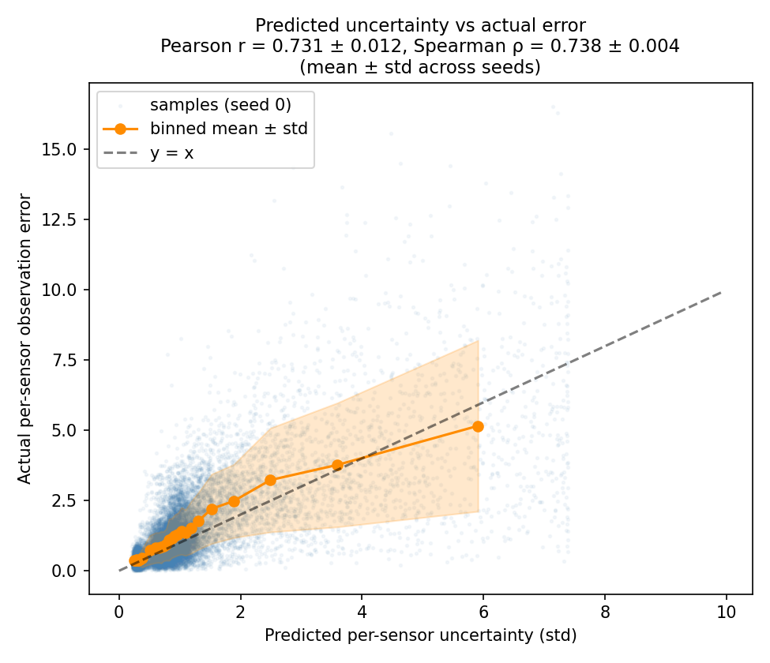

**Result:** Pearson r = 0.731 ± 0.012, Spearman ρ = 0.738 ± 0.004 (mean ± std
over 5 seeds, both p ≈ 0) — a strong, consistent monotonic relationship.

### Experiment B (bonus) — does uncertainty rise with injected noise?

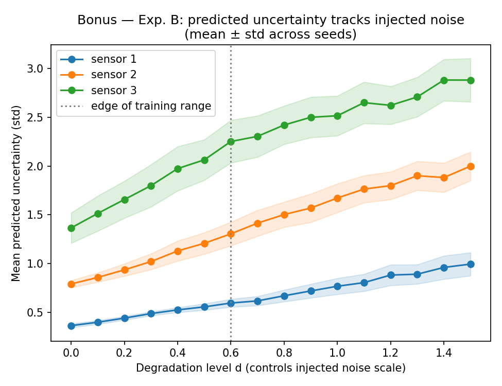

**Result:** monotonically increasing for all 3 sensors, consistently across
seeds, including somewhat beyond the training range.

### Experiment C (ablation) + Graph 2 — accuracy vs. degradation severity, full baseline ladder

The proposed model's predicted variances are randomly **shuffled** across
samples (same marginal distribution of predicted uncertainty, decorrelated
from actual per-sample error) and plugged into the identical fusion rule —
this isolates whether *correlation* with true error is what matters, or just
having variable weights at all.

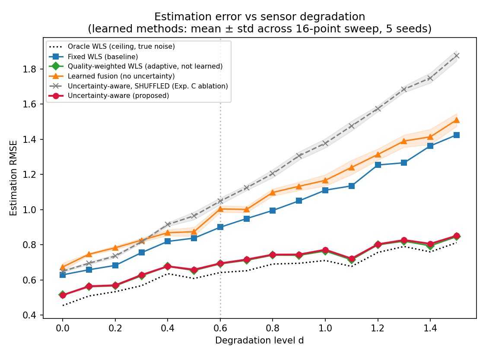

**Results (mean RMSE across the full degradation sweep):**

| Method | Mean RMSE |
|---|---|
| Oracle-variance WLS (reference) | 0.655 |
| Uncertainty-aware (v1) | 0.705 |
| Quality-weighted WLS (heuristic, not learned) | 0.701 |
| Fixed WLS (baseline) | 0.989 |
| Learned fusion (no uncertainty) | 1.065 |
| Uncertainty-aware, shuffled (ablation) | 1.200 |

Two things are true at once here, and both matter:

1. **The shuffled ablation has the highest mean RMSE of the six** (1.200), and it is
   worse than plain fixed WLS from `d = 0.4` upward (not at every level).
   Decorrelating the predicted variances from the actual per-sample error
   removes the benefit, so the correlation with error is what matters, not
   merely having variable weights.
2. **The learned model does *not* beat the quality-weighted heuristic**
   (0.705 vs. 0.701, a near-tie; the heuristic has the lower RMSE at 14 of 16
   levels of the sweep). Both stay about 0.05 RMSE above the oracle-variance
   reference. Evaluation-draw noise is about 0.01-0.02 RMSE, so differences of
   that size are not interpreted. See "Tier 1 finding" below.

### Experiment D — does calibration survive an unseen sensor regime? (Graph 3)

Trained only on Gaussian noise with a moderately reliable quality signal.
Tested at a fixed degradation level (`d=0.5`) under two regimes:
in-distribution (Gaussian noise) vs. **shifted** (heavy-tailed Student-t
noise, a much less reliable quality signal, 2.5× more frequent bias faults —
none of which the model trained on).

Calibration is assessed with **NEES** (Normalized Estimation Error Squared,
`‖x̂ − x‖² / V`), the standard chi-squared consistency check from Kalman
filtering theory.

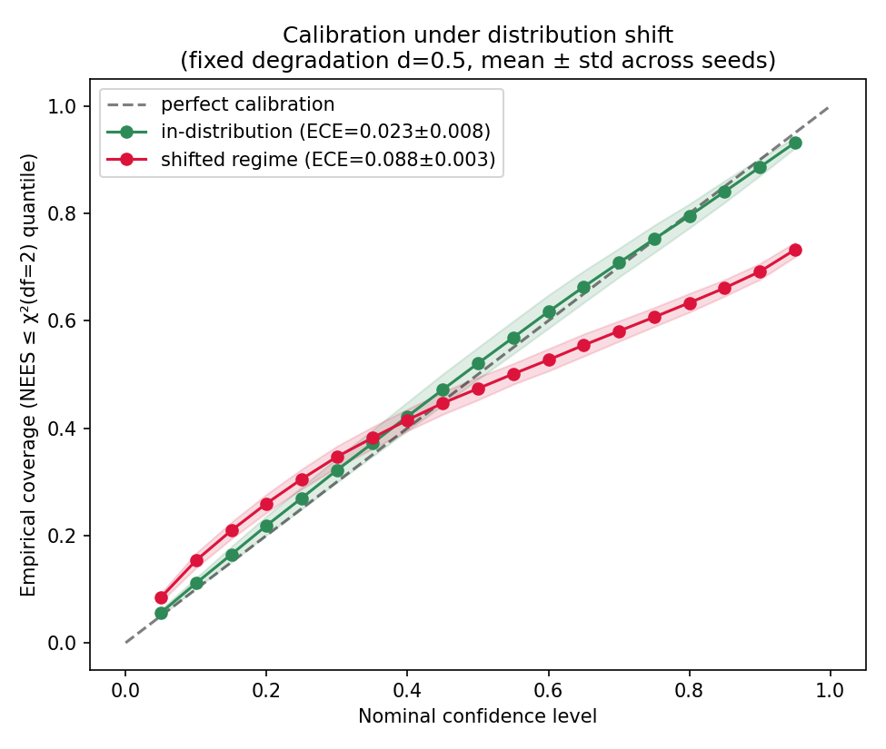

**Result:** ECE = 0.023 ± 0.008 in-distribution vs. 0.088 ± 0.003 under shift
(mean ± std over 5 seeds) — calibration **degrades but doesn't collapse**, and
the model becomes mildly overconfident at high nominal-confidence levels under
shift. This is a deliberately honest finding rather than a "calibration is
invariant" claim, and the seed-to-seed variance is small enough that the
degradation is clearly a real effect, not noise.

### Failure analysis — does the model know *which* sensor is degraded? (Graph 4)

The simulator knows, per sample, which sensor is the "stressed" one
(`degraded_sensor` in `data/simulate.py`) — information never given to any
model, only used for evaluation. This directly operationalizes a claim that
was previously only implied: can the uncertainty model actually **identify**
a degraded source, not just produce numbers that happen to correlate with
error on average?

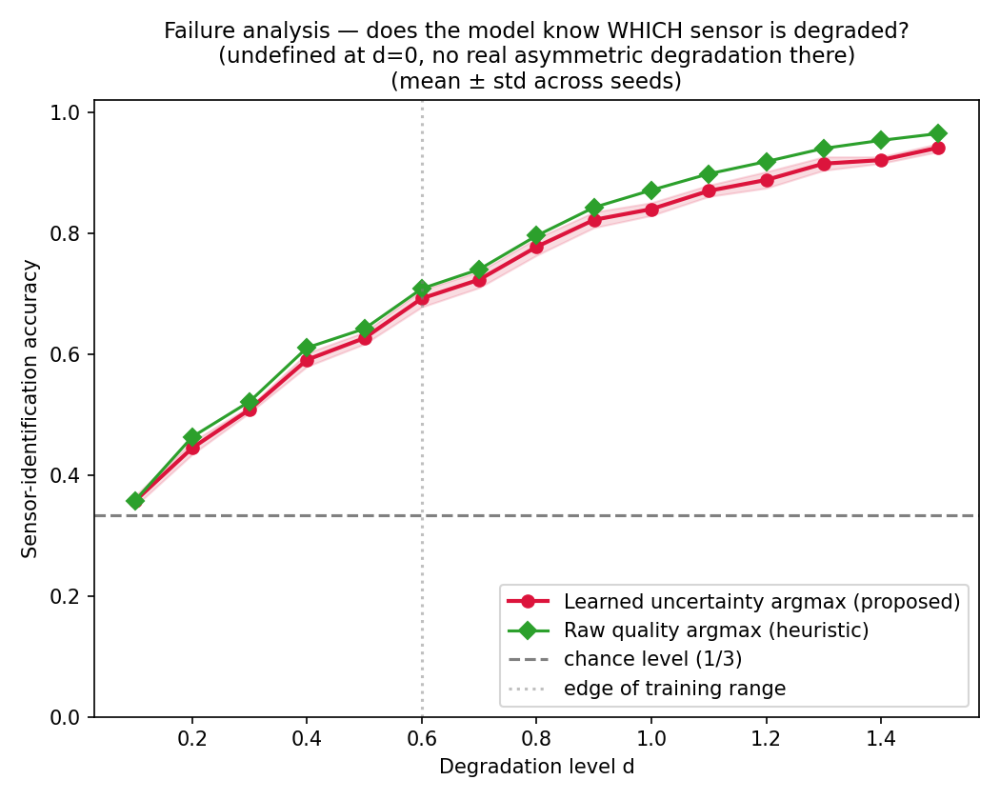

**Result:** both the learned model and the quality-argmax heuristic climb
from chance level (33%) to >90% identification accuracy as degradation
increases, and the heuristic is 1.4-3.3 points ahead of the learned model.
This metric is descriptive: the `argmax` also ranks sensors that were dropped
out, so absolute values are depressed when another sensor is missing.

## Tier 1 finding, and two follow-ups

The headline result of this round of work is **not** "the proposed
method wins." It's: a two-line, non-learned heuristic (`variance = quality²`)
matches or marginally beats a trained neural network on every metric tested.
Two candidate explanations (neither tested directly):

1. **The quality proxy is already a strong noise estimator by construction**
   (`quality ≈ true_std × fault_boost × (1 + 15% noise)` in `data/simulate.py`)
   — there's limited headroom for a network to improve on "square it and use
   it directly."
2. **The uncertainty model is architecturally per-sensor-independent** — it
   only ever sees `[obs_i, quality_i, mask_i]` for sensor `i` alone, with no
   way to notice "sensors 1 and 2 agree with each other but sensor 3 doesn't."
   The quality heuristic can't use that signal either, which is exactly why
   the two methods converge to similar performance: neither has access to the
   one kind of information that could differentiate them.

This also caught and fixed a real bug: the original "oracle" baseline used
only each sensor's Gaussian noise std, ignoring that bias faults occur at a
baseline rate on *any* sensor (not just the flagged "degraded" one per
sample) — so a sensor could look precise (small std) while carrying a large
deterministic bias, and the naive oracle would over-trust it. That oracle was
sometimes *worse* than the heuristic, which is a contradiction (an oracle with
strictly more information should never lose). Fixed in `data/simulate.py` by
having `oracle_var` include the realized bias contribution, which restored
the expected ordering (oracle-variance WLS has the lowest RMSE in the reported results).

### Follow-up: does a cross-sensor feature fix it?

**Hypothesis:** if the bottleneck is that the model can't see cross-sensor
disagreement, giving it that information directly should help. Tested in
`experiments/followup_cross_sensor.py`: an otherwise-identical uncertainty
model, but with one added input feature per sensor — its residual magnitude
against a leave-one-out consensus of the *other* observed sensors
(`data/simulate.py`'s `per_sensor_features_v2`).

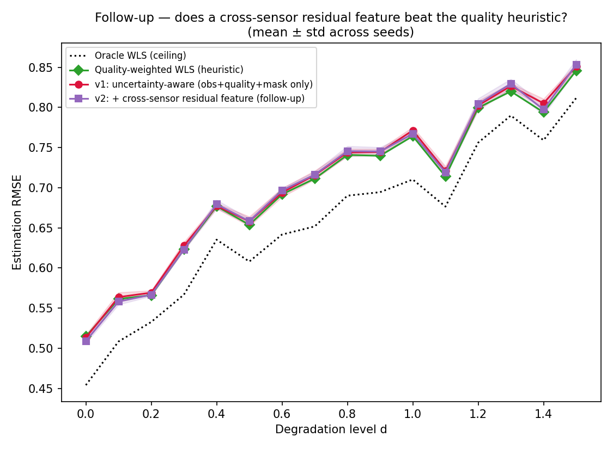

**Result: no meaningful improvement.** The cross-sensor feature changes mean
RMSE from 0.7054 to 0.7043 (a difference of 0.0010, not interpreted: the two
variants are separate network instances), and it does not reach the quality
heuristic (0.7011). Sensor-identification accuracy is unchanged (0.7275 vs.
0.7278 for v1; 0.7485 for the heuristic).

**A possible reading (a hypothesis, not tested):** all three
adaptive/learned methods — heuristic, v1, v2 — sit at a nearly *identical*,
persistent ~0.05 RMSE gap above the oracle-variance reference across the entire
degradation sweep (visible as three overlapping curves in the figure above).
That's a different signature than "the model can't tell which sensor is
bad" (Graph 4 shows all methods clearly can, at >90% accuracy under strong
degradation). It looks more like a *soft-weighting* ceiling: inverse-variance
WLS downweights a suspected-bad sensor proportionally, but a bias fault is
better modeled as roughly bimodal (a sensor is either fine or wildly off, not
continuously "a bit worse"), which a smooth precision-weighted average is
fundamentally not well-suited to punish hard enough. A robust-statistics-style
mechanism that can *nearly exclude* a sensor once suspected (Huber
reweighting, or a hard gate) rather than merely inflate its assumed variance
is the natural next thing to test — noted as a concrete direction rather than
attempted here, since it changes the fusion rule itself rather than the
uncertainty model's inputs.

### Follow-up 2: does classical robust fusion (Huber / Tukey IRLS) close the gap?

**Hypothesis:** if soft, linear precision weighting is the actual bottleneck,
replacing it with classical robust M-estimation should help. Tested in
`experiments/followup_robust_fusion.py`: Iteratively Reweighted Least Squares
(`inference/robust_fusion_numpy.py`) with two robust psi-functions — Huber
(soft downweight past a threshold `c`, weight ~ 1/r, never reaches exactly
zero) and Tukey biweight (smoothly falls to *exactly* zero past `c` — genuine
hard gating). Layered on top of two prior variance sources: the quality
heuristic, and the learned v1 model. The threshold `c` was tuned by grid
search on a **held-out validation set, never the actual evaluation
protocol**, to avoid overfitting the baseline to the test data.

Building this method honestly surfaced two real implementation pitfalls
worth naming, because both would have produced a misleadingly positive result
if missed: (1) standardizing residuals by each sensor's *own* claimed
precision is circular and caused total collapse on an adversarial test case —
fixed by standardizing against a robust *group* scale (MAD-like, from the
sensors' mutual agreement) instead; (2) naive fixed-point IRLS iteration is
unstable here — once a severe outlier gets *any* nonzero weight, the fused
estimate drifts toward it, shrinking its own residual and increasing its
weight further, a runaway feedback loop that converges to *trusting* the
outlier more, not less. Damped updates fix this for Tukey; **Huber's
psi-function is exactly 1.0 (zero downweighting) below its threshold, so it
can still get permanently stuck at a bad fixed point even with damping and a
robust median start** — a real, known distinction between monotone
(Huber-type) and redescending (Tukey-type) M-estimators, not an
implementation bug, and confirmed to persist at full convergence (see the
function's docstring for the reproducible toy case). Also caught: the first
tuning pass showed a tiny apparent improvement from IRLS that vanished
entirely once the iteration count was increased enough to actually
converge — an artifact of stopping too early, not a real effect. All of this
is exactly the kind of thing that either gets caught by careful testing or
silently inflates a result; it's reported here rather than smoothed over.

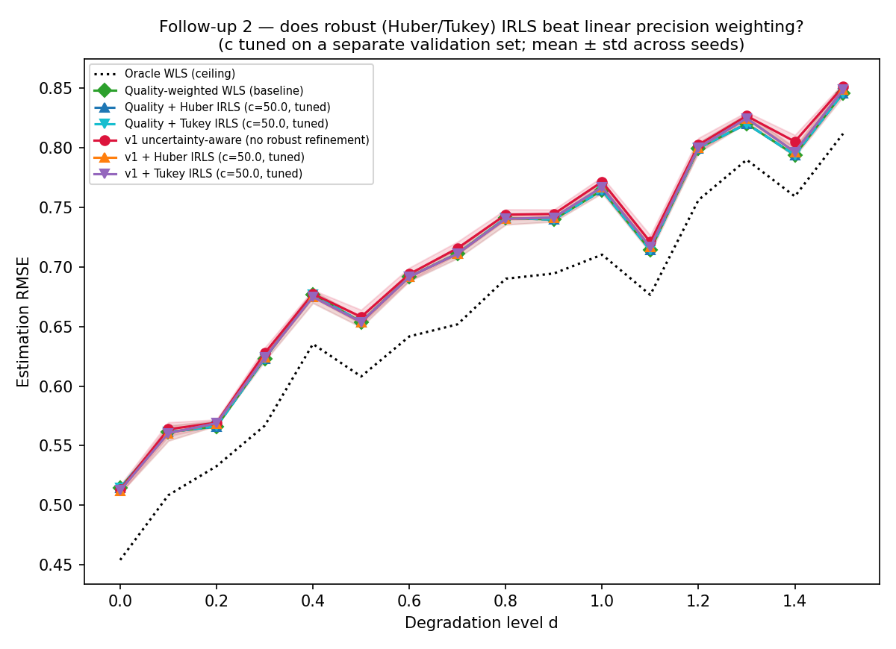

**Result: no benefit over the quality heuristic.** The validation data selected
the largest threshold in the grid, `c = 50`, for both psi-functions and both
priors. At that setting almost no sensor is down-weighted, so IRLS is close to
plain weighted fusion: Huber matches Quality WLS to four decimals (0.7011) and
Tukey is within 0.0001.

The v1 rows differ from plain v1 by 0.0033 (0.7054 to 0.7020). This is **not**
interpreted as a benefit of robust reweighting: the v1 baseline and the v1
used for IRLS are different network instances, and plain fusion was not
computed on the latter. The v1 + IRLS sensor-identification entry is seed 0
only.

**Sensor identification with IRLS weights:** ranking sensors by the final IRLS
weight gives 0.608 for the heuristic prior, below the heuristic's 0.749. This is
largely a property of the metric: a dropped sensor receives almost zero weight
and is therefore ranked most suspect, so the stressed sensor is missed whenever
another sensor is dropped (probability of no other dropout is about 0.81, and
0.749 x 0.81 is about 0.61).

**Interpretation (a hypothesis):** robust estimators rely on redundancy to
separate a true outlier from natural spread. With only three sensors there is
little, which may explain why the validation data preferred no reweighting. It
is consistent with the cross-sensor result above. Repeating the experiments
with more sensors would test it directly.

## Tier 2: stronger shifts, full calibration curves, and three more ablations

Everything in this section builds on the Tier-1 finding above and follows the
same discipline: fixed evaluation protocols, multi-seed aggregation, and
negative results reported as plainly as positive ones.

### Shift taxonomy (`experiments/tier2_shift_taxonomy.py`)

Tier 1's Experiment D used one combined shift at one severity. This replaces
it with 4 **distinct** shift mechanisms, each at 2 severities, all at a fixed
degradation level (`d=0.5`, isolating the shift mechanism from degradation
severity):

| Shift | Mechanism |
|---|---|
| Heavy-tailed noise | Student-t instead of Gaussian (mild: df=10, severe: df=3) |
| Quality corruption | the self-reported quality proxy becomes a much worse estimate of true noise |
| Correlated degradation | 2 or all 3 sensors degrade simultaneously (training only ever has exactly 1) |
| Deceptive sensor | a biased sensor *lowers* its reported quality instead of raising it — confidently wrong, not just wrong |

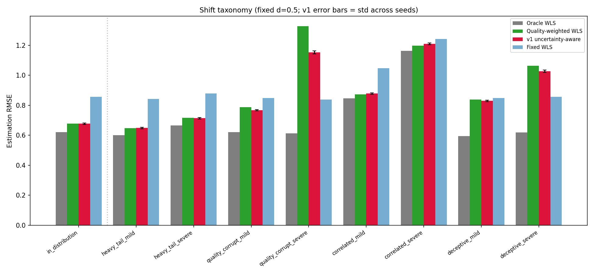
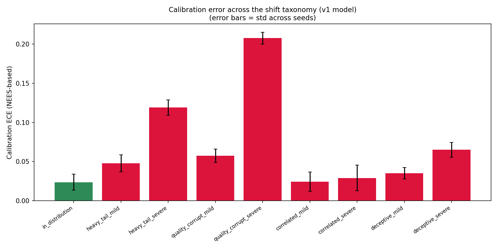

Mean RMSE per shift (5 training seeds, `d = 0.5`):

| Shift | Fixed WLS | Quality WLS | v1 | Oracle-var. WLS |
|---|---|---|---|---|
| In-distribution | 0.856 | 0.678 | 0.678 | 0.621 |
| Quality corruption, severe | 0.838 | 1.328 | 1.153 | 0.614 |
| Deceptive sensor, severe | 0.857 | 1.063 | 1.027 | 0.620 |
| Deceptive sensor, mild | 0.848 | 0.838 | 0.830 | 0.595 |
| Correlated, all 3 sensors | 1.243 | 1.198 | 1.210 | 1.163 |

- **Quality corruption (severe):** v1 is less affected than the heuristic
  (1.153 vs. 1.328), but **fixed weighting is better than both (0.838)**. The
  oracle is barely changed, so only the self-reported signal is corrupted.
- **Deceptive sensor (severe):** same ordering (1.027 vs. 1.063, fixed 0.857).
  The mild-severity difference (0.830 vs. 0.838) is within evaluation-draw
  noise and is not interpreted.
- **Correlated degradation:** v1 and the heuristic are tied, and calibration
  stays low (ECE about 0.03) even with all three sensors degraded.
- **Calibration damage** is largest under severe quality corruption (ECE 0.208),
  then severe heavy-tailed noise (0.119), then the deceptive and mild
  quality-corruption shifts (0.035-0.065); correlated degradation barely moves it.

A possible explanation for v1's smaller loss relative to the heuristic is that
its predicted variance is bounded (log-variance in [-4, 4]) while the heuristic's
weights are not. This was **not** tested (for example by clipping the heuristic).

### Full calibration curves, sharpness, and recalibration (`experiments/tier2_calibration.py`)

Tier 1 reported calibration at one degradation level. This sweeps the full
range, for both the Gaussian (in-family) and Student-t (shifted-family)
noise regimes:

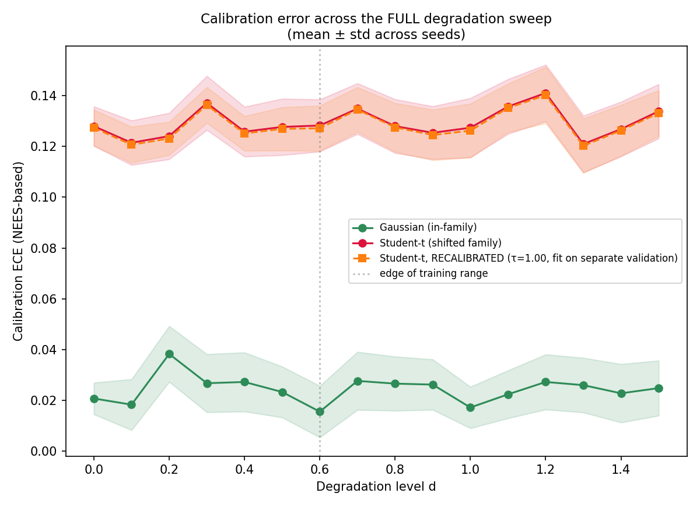

**Calibration under the Gaussian family stays flat and low (ECE ~0.02–0.04)
across the ENTIRE sweep**, including well past the training range (`d` up to
1.5, trained only to 0.6) — severity alone, without a family mismatch,
doesn't break calibration here. The Student-t shift instead produces a
**roughly constant ECE offset (~0.10–0.14) regardless of degradation
level** — not something that compounds with severity, a family-mismatch
penalty rather than a severity penalty.

That distinction directly explains the recalibration result. A single
scalar variance-scaling factor τ was fit by matching the first moment of the
NEES distribution (`E[NEES] = 2` under correct calibration) on a **held-out
validation set**, never the actual evaluation data:

**τ = 0.998 ± 0.054 — essentially 1.0. Applying it barely moves ECE (0.1292
→ 0.1284).** Recalibration doesn't help, and the reason is visible directly
in the sharpness companion plot:

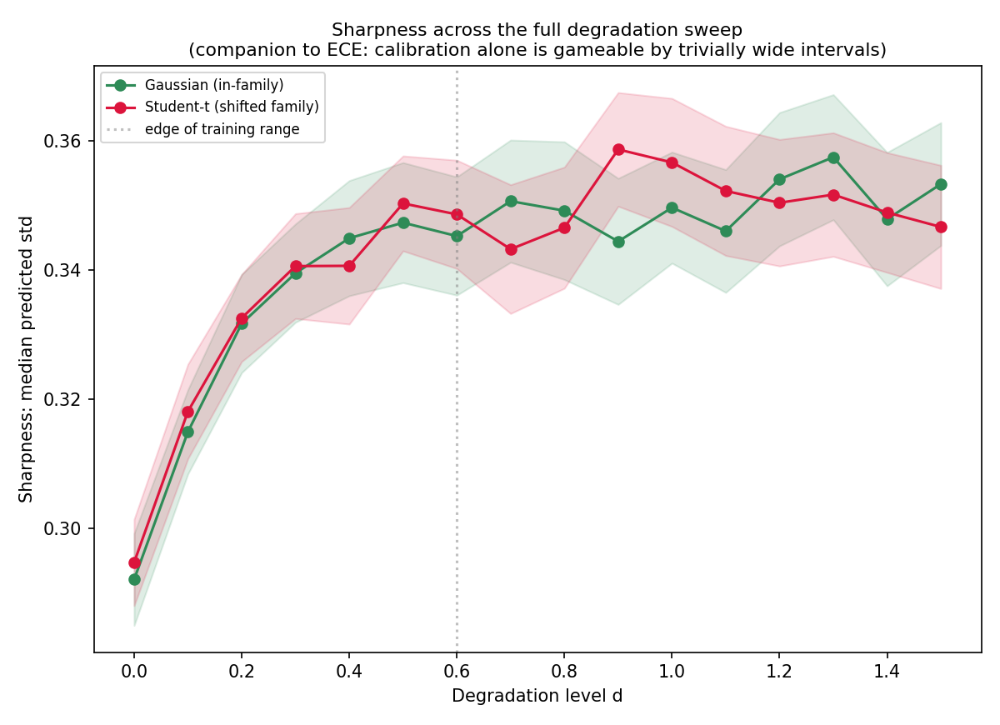

**Median predicted sharpness is essentially identical between the two noise
families at every degradation level** — the model doesn't widen its
intervals under heavy tails at all, yet ECE differs about fivefold. A scalar
recalibration can only fix a uniform too-narrow/too-wide *scale* problem;
this is consistent with a distributional *shape* mismatch (Gaussian
assumption vs. actual heavy tails), which one scalar cannot correct. Only one
scalar recalibration (moment matching) was tried.

### Three more ablations (`experiments/tier2_ablations.py`)

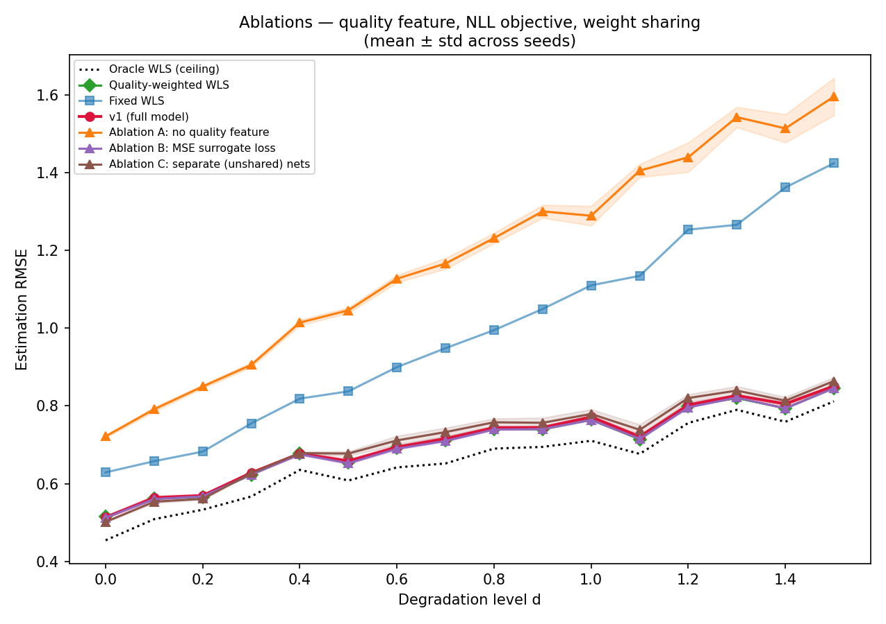

| Ablation | Mean RMSE | Mean sensor-ID acc. | Pearson r (± std across seeds) |
|---|---|---|---|
| v1 (reference) | 0.705 | 0.728 | 0.731 |
| A: no quality feature | 1.184 | 0.373 (≈ chance) | 0.364 ± 0.055 |
| B: MSE surrogate loss | 0.700 | 0.749 | 0.758 ± 0.002 |
| C: separate (unshared) nets | 0.715 | 0.795 | 0.651 ± 0.044 |

- **A:** without the quality feature the model is worse than fixed WLS (1.184
  vs. 0.989) and sensor-identification falls to 0.373, close to chance. The
  quality signal is the dominant useful per-sensor input for this architecture.
- **B:** a decoupled per-sensor MSE regression onto `log((obs_i - true_pos)^2)`
  matches the NLL-through-fusion objective (0.700 vs. 0.705, a difference not
  interpreted). Under these conditions the coupling to the fusion rule gives no
  visible advantage. B is also trained on the rows of dropped sensors, so its
  sensor-ID value is not directly comparable with v1's.
- **C:** unshared networks have slightly worse RMSE (0.715 vs. 0.705), higher
  sensor-ID (0.795 vs. 0.728, subject to the dropped-sensor effect) and a
  larger seed-to-seed spread of the correlation (0.044 vs. 0.012). This cannot
  be attributed to weight sharing alone: separate networks implicitly know which
  sensor they serve, and no shared network with a sensor-index input was run.

Note: these three ablations were only implemented for the NumPy engine. They
reuse the MLP backward pass checked in `tests/test_gradients.py`; the
MSE-surrogate loss gradient has no separate finite-difference test. No PyTorch
equivalents were built.

## Two engines: NumPy vs. PyTorch

Both `training/train_numpy.py` and `training/train_torch.py` implement the
exact same models and loss. The difference is purely in how gradients are
computed:

- **NumPy engine** (`--engine numpy`, default, no extra dependency): the
  MLP's backward pass and the structured-fusion NLL's gradient w.r.t.
  predicted log-variance are both **hand-derived** (the derivation is in
  `inference/fusion_numpy.py`'s docstring) and implemented directly. The
  fusion-NLL gradient and the MLP backward pass are checked against finite
  differences in `tests/test_gradients.py` (observed max absolute error 1.3e-6
  for the NLL gradient on a small random batch, below 1e-9 for the MLP).
- **PyTorch engine** (`--engine torch`, requires `requirements-torch.txt`):
  the same forward computation is written in `torch` tensors
  (`inference/fusion_torch.py`), and `loss.backward()` computes the identical
  gradient automatically. No manual derivative bookkeeping.

Comparing `inference/fusion_numpy.py` to `inference/fusion_torch.py` is a
reasonably concrete illustration of what autograd buys you.

## Installation & usage

```bash
git clone https://github.com/AboOraig/uncertainty-multimodal-inference
cd uncertainty-aware-multimodal-inference
pip install -r requirements.txt

# verify every hand-derived gradient against finite differences
python -m tests.test_gradients

# run the full experiment suite (numpy engine, 5 seeds, no torch needed)
python -m experiments.run_experiments --engine numpy

# labeled follow-up 1 (run AFTER the above -- reuses its results_summary.json):
# does a cross-sensor feature close the gap to the heuristic?
python -m experiments.followup_cross_sensor --engine numpy

# labeled follow-up 2 (also run after the core pipeline): does classical
# robust (Huber/Tukey) fusion beat linear precision weighting?
python -m experiments.followup_robust_fusion --engine numpy

# Tier 2 (each independent, run after the core pipeline; numpy only):
python -m experiments.tier2_shift_taxonomy --engine numpy
python -m experiments.tier2_calibration --engine numpy
python -m experiments.tier2_ablations --engine numpy
```

For the PyTorch engine:

```bash
pip install -r requirements-torch.txt

# fast (~seconds) sanity check that the torch pipeline runs and losses
# decrease, before committing to the full run
python -m tests.test_torch_pipeline

python -m experiments.run_experiments --engine torch
```

Either command writes 4 figures and `results_summary.json` to
`results/<engine>/`. Follow-up 1 writes 2 figures and `followup_results.json`
to `results/<engine>/followup_cross_sensor/`. Follow-up 2 writes 1 figure and
`followup_robust_results.json` to `results/<engine>/followup_robust_fusion/`.

All simulation, training, and experiment hyperparameters live in
`configs/default.py` — nothing is hardcoded elsewhere in the codebase.

## Limitations

- The learned model does not outperform a two-line non-learned heuristic on
  raw accuracy or sensor identification in the nominal sweep (see "Tier 1
  finding"). The shuffled-variance ablation shows the learned variances carry
  real information, but not more than the quality signal already does.
- Neither cross-sensor attempt (residual feature, Huber/Tukey IRLS) beat the
  heuristic. With three sensors there is little redundancy to exploit; testing
  with more sensors is untested here (the simulator's degraded-sensor and bias
  logic assumes three and would need generalizing).
- **Separate network instances.** v1, v2, v1 + IRLS and the ablation variants are
  trained as separate instances, so differences of a few thousandths of RMSE
  (for example 0.7054 vs. 0.7043, or 0.7054 vs. 0.7020) are not interpreted.
- **Evaluation-draw noise** of about 0.01-0.02 RMSE: the same method gives
  slightly different values on the sweep set and the shift set (Quality WLS at
  `d = 0.5`: 0.654 vs. 0.678).
- **Sensor-ID metric** uses an `argmax` that includes dropped sensors, so it is
  descriptive and depressed when another sensor is missing; this also explains
  the lower IRLS values. The v1 + IRLS sensor-ID entry is seed 0 only.
- **Missing controls:** no clipped-heuristic control (the bounded-variance
  explanation of the shift results is untested), no shared network with a
  sensor-index input (ablation C is confounded), and no test of the Tier-1
  explanations directly.
- **All-dropped samples** (probability (1+d) x 0.075%) are handled differently by
  the WLS methods and by learned fusion.
- Reported standard deviations are population standard deviations (`ddof=0`)
  over 5 seeds.
- Fully synthetic data: absolute numbers do not transfer, only the methodology
  and qualitative findings. The quality proxy is a strong, always-present
  feature; real self-diagnostics are often less reliable.
- Single-shot (per-instance) fusion, not a temporal filter. No hyperparameter
  search was done. A real-data evaluation is a natural next step.
- Tier 2 (shift taxonomy, calibration curves, ablations) and both follow-ups
  were run on the NumPy engine only. The PyTorch run covers the core pipeline
  and does not include the heuristic baseline; its learned-fusion baseline
  differs from the NumPy one (0.991 vs. 1.065 mean RMSE).
- A scalar recalibration cannot fix a shape mismatch; a different predictive
  distribution (for example a Student-t output head) is untested.

## Paper-to-code map

| Paper content | Script | Results file |
|---|---|---|
| Baseline ladder, sweep, sensor-ID, uncertainty-error correlation | `experiments/run_experiments.py` | `results/numpy/results_summary.json` |
| Cross-sensor feature | `experiments/followup_cross_sensor.py` | `results/numpy/followup_cross_sensor/followup_results.json` |
| Huber/Tukey IRLS | `experiments/followup_robust_fusion.py` | `results/numpy/followup_robust_fusion/followup_robust_results.json` |
| Shift taxonomy | `experiments/tier2_shift_taxonomy.py` | `results/numpy/tier2_shift_taxonomy/tier2_shift_results.json` |
| Calibration, sharpness, recalibration | `experiments/tier2_calibration.py` | `results/numpy/tier2_calibration/tier2_calibration_results.json` |
| Ablations A, B, C | `experiments/tier2_ablations.py` | `results/numpy/tier2_ablations/tier2_ablations_results.json` |

## License

This project is released under the [MIT License](LICENSE).
